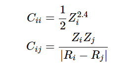

# Documentation

## Step 1: Understand the dataset

The dataset is a subset of GDB-13 (a database of nearly 1 billion stable and synthetically accessible organic molecules) composed of all molecules of up to 23 atoms (including 7 heavy atoms C, N, O, and S), totalling 7165 molecules. The Coulomb matrix representation of these molecules and their atomization energies computed similarly to the FHI-AIMS implementation of the Perdew-Burke-Ernzerhof hybrid functional (PBE0) is provided. This dataset features a large variety of molecular structures such as double and triple bonds, cycles, carboxy, cyanide, amide, alcohol and epoxy. The Coulomb matrix is defined as:



1.Input (X)

- Coulomb matrices representing the molecular structures, shape 7165 x 23 x 23

- Each Coulomb matrix is a 23 x 23 array represent a molecular structure

- There are total 7165 matrices in the data set

2.Output (T)

- Shape: 7165

- Each value in T represent the atomization energy of a corresponding molecule

3.Cross-validation splits (P)

- Shape: 5 x 1433

- Each row in the array represent a specific split

- 5 rows: 5 different cross-validation splits, each row contains 1433 indices

- The P array is to partition the dataset into training and validation sets according to predefined splits

4.Atomic charges (Z)

- Shape: 7165 x 23

- Each row correspond to one molecule

- Each entry in a row represents the atomic charge of an atom in the molecule

5.Cartesian Coordinates (R)

- Shape: 7165 x 23 x 3

- Each row correspond to one molecule

- Each subarray within a row contains the 3D coordinates for each atom

## Step 2: Data preprocessing

### Program parameters

```python
# Parameters
seed  = 3453
mb    = 25     # size of the minibatch
hist  = 0.1    # fraction of the history to be remembered
```

### Load data

```python
# Load data
if not os.path.exists('qm7.mat'):
    os.system('wget http://www.quantum-machine.org/data/qm7.mat')
dataset = scipy.io.loadmat('qm7.mat')

```

### Extract training data

The P two-dimensional array contains the cross-validation split data for training and testing set. Four rows in the array will be used for training and the remaining row will be used for testing which make the 75% of the data is for training and 25% of the data is for testing.

```python
# Extract training data
split = int(sys.argv[1]) # test split for cross-validation (between 0 and 5)
train_indices = list(range(0, split)) + list(range(split + 1, 5)) # train indices 75%, test 25%
P = dataset['P'][train_indices].flatten() # convert 2D array to 1D array
X = dataset['X'][P] # input: select only those rows (molecules) that correspond to the training data
T = dataset['T'][0, P] # T contains the corresponding output targets (atomization energies) for the training data

# Flatten X
X_flat = X.reshape(X.shape[0], -1) # convert 3D array to 2D array
```

### Standardize the data

Using the StandardScaler() class from the skit-learn library. StandardScaler is a class in scikit-learn that standardizes features by removing the mean and scaling to unit variance. Standardization is important because many machine learning algorithms perform better or converge faster when the input features are scaled. The standard score of a sample x is calculated as:
`z = (x - u) / s` where u is the mean of the training samples or zero if with_mean=False, and s is the standard deviation of the training samples or one if with_std=False.

```python
# import statement
from sklearn.preprocessing import StandardScaler
```

```python
scaler = StandardScaler()
X_flat = scaler.fit_transform(X_flat)
```

## Step 3: Implement Machine Learning Model

### Define and train the model

The purpose of this step is to create a set of diverse models to be trained and evaluated on the dataset. Different types of models is used to compare their performance and select the best one. This approach used merely the traditional Machine Learning method including Linear Regression, Support Vector Regression, Gaussian Process and Multilayer Perceptron. These models are provided by the scikit-learn library.

```python
# import statement
from sklearn.linear_model import LinearRegression
from sklearn.svm import SVR
from sklearn.gaussian_process import GaussianProcessRegressor
from sklearn.neural_network import MLPRegressor
```

- Linear regression models the relationship between the dependent variable (target) and one or more independent variables (features) by fitting a linear equation to the observed data.
- SVR is a type of Support Vector Machine (SVM) used for regression tasks. It tries to fit the best line within a threshold value (epsilon) that maximizes the margin between data points.
- Gaussian Process Regression is a non-parametric, Bayesian approach to regression that provides a distribution over functions. It is particularly useful for problems where the data is noisy or the underlying function is complex.
- MLP is a type of feedforward artificial neural network. It consists of multiple layers of neurons, including an input layer, one or more hidden layers, and an output layer. Each neuron in a layer is connected to every neuron in the subsequent layer.

```python
# Define and train models
models = {
    "Linear Regression": LinearRegression(),
    "Support Vector Regression": SVR(),
    "Gaussian Process": GaussianProcessRegressor(),
    "Multilayer Perceptron": MLPRegressor(hidden_layer_sizes=(400, 100), max_iter=1000)
}
```

## Step 4: Model training and evaluation

The loop iterates over the dictionary of models, trains each model, makes predictions, and evaluates the performance using Mean Absolute Error (MAE).

```python
for name, model in models.items():
    # Train the model
    model.fit(X_flat, T) # X_flat: input, T: output
    # Predict
    predictions = model.predict(X_flat)
    # Calculate Mean Absolute Error
    mae = mean_absolute_error(T, predictions)
    results[name] = mae
    print(f'{name} Mean Absolute Error: {mae}')
```

## Step 5: Visualization and analysis

## References

[QM7 Dataset](http://quantum-machine.org/datasets/)

[StandardScaler](https://scikit-learn.org/stable/modules/generated/sklearn.preprocessing.StandardScaler.html)
